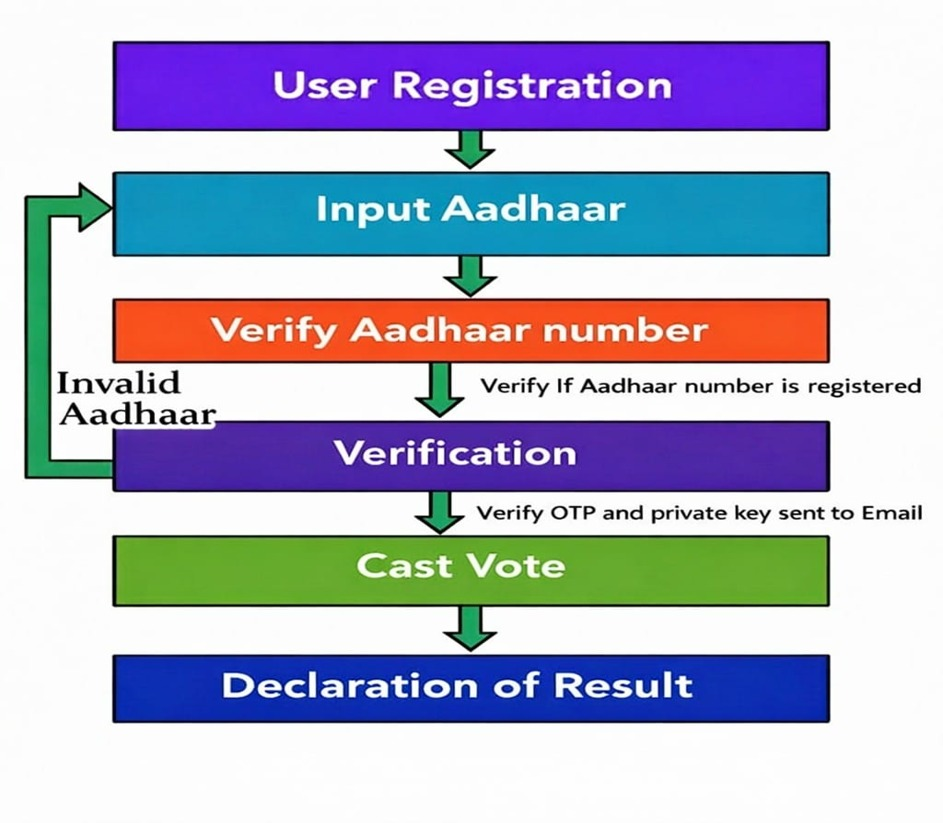
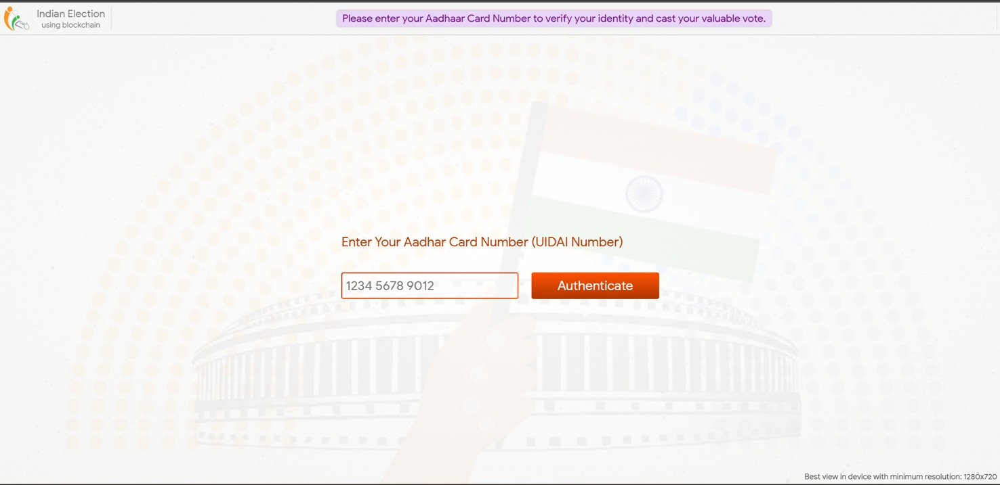
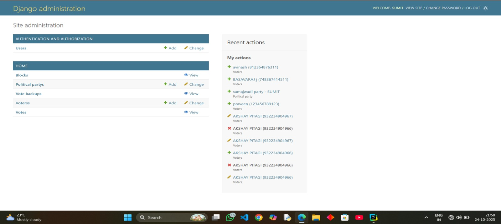
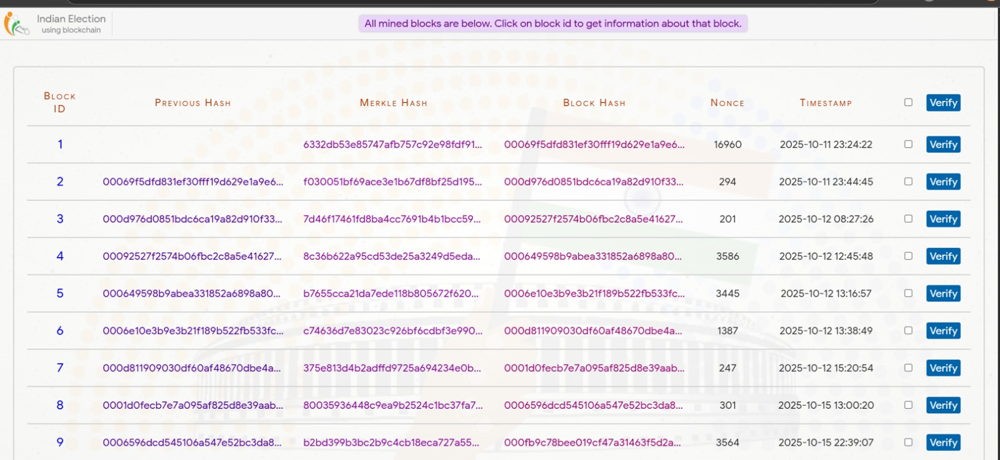

# 🗳️ E-Voting Using Blockchain Technology


_A secure and transparent electronic voting system that improves voting security, data integrity, transparency, and traceability using Blockchain, Django, and Ethereum._

---

---

## 📩 Project Availability & Contact

If you are interested in this project, feel free to contact me.
I can provide the project details and discuss the requirements.

---

## Contact

**Techvanta**  
Software Engineer

📱 Call/WhatsApp: 7996671287
📧 Email: techvanta.dev@gmail.com 

## 📌 Table of Contents

- [Overview](#overview)
- [Business Problem](#business-problem)
- [Data Model](#data-model)
- [Tools & Technologies](#tools--technologies)
- [Project Structure](#project-structure)
- [Data Validation & Preparation](#data-validation--preparation)
- [Admin Analytics & Reporting](#admin-analytics--reporting)
- [Key Features & System Functionality](#key-features--system-functionality)
- [E-Voting Workflow](#e-voting-workflow)
- [Project Screenshots](#project-screenshots)
- [How to Run This Project](#how-to-run-this-project)
- [Security Recommendations](#security-recommendations)
- [Author & Contact](#author--contact)

---

## Overview

This project presents a secure and transparent **E-Voting System using Blockchain Technology** to address the security, privacy, data integrity, and transparency challenges of traditional electronic voting systems.

The system uses **Django** as the backend framework and applies blockchain concepts such as **hashing, block creation, block sealing, and transaction verification** to maintain tamper-resistant voting records.

It provides voter authentication, political party and candidate management, vote casting, blockchain transaction recording, block verification, vote backup, and election result management.

---

## Business Problem

Traditional voting systems face challenges related to security, transparency, privacy, data integrity, and unauthorized manipulation.

This project aims to:

- Prevent unauthorized access to and manipulation of voting data.
- Authenticate voters using Aadhaar-based verification.
- Protect voting records using hashing and blockchain technology.
- Maintain tamper-resistant and traceable voting records.
- Improve transparency throughout the voting process.
- Provide reliable election result management.
- Maintain blockchain-based records of voting transactions.

---

## Data Model

The system uses structured voter, political party, candidate, vote, and blockchain transaction data.

### Voter Data

- Aadhaar Number
- Name
- Date of Birth
- Email
- Pincode
- Region
- Profile Picture
- Voting Status

### Political Party Data

- Party ID
- Party Name
- Candidate Name
- Party Logo
- Candidate Profile Picture

### Vote Data

- Vote ID
- Selected Party/Candidate
- Timestamp
- Block ID
- Blockchain Transaction Hash

### Blockchain Data

- Block ID
- Previous Block Hash
- Merkle Hash
- Block Hash
- Nonce
- Timestamp
- Transaction Information

> **Note:** This project is intended for educational and demonstration purposes. Use synthetic or demo data during development and testing. Never use real Aadhaar information.

---

## Tools & Technologies

| Category | Technology |
|---|---|
| Programming Language | Python 3 |
| Backend Framework | Django |
| Database | SQLite |
| Blockchain | Ethereum |
| Frontend | HTML5, CSS |
| Data Format | JSON |
| Authentication | Email / OTP Verification |
| Development Environment | VS Code / PyCharm |
| Operating System | Windows |
| Browser | Any modern web browser |

---

## Project Structure

```text
E-Voting-using-Blockchain-Technology/
│
├── Election/
│   ├── settings.py
│   ├── urls.py
│   ├── wsgi.py
│   └── ...
│
├── home/
│   ├── migrations/
│   ├── templates/
│   ├── static/
│   ├── models.py
│   ├── views.py
│   ├── forms.py
│   ├── urls.py
│   └── ...
│
├── media/
│
├── images/
│   ├── e-voting-workflow.jpeg
│   ├── admin-dashboard.jpeg
│   ├── voter-verification.jpeg
│   ├── candidate-selection.jpeg
│   └── blockchain-blocks.jpeg
│
├── manage.py
├── requirements.txt
└── README.md
```

---

## Data Validation & Preparation

- Removed invalid or incomplete voter records.
- Eliminated duplicate voter and voting transaction entries.
- Validated voter details such as Aadhaar number, email, age, and pincode.
- Standardized data formats and converted fields into appropriate data types.
- Verified political party and candidate information for consistency.
- Prepared structured voter, party, vote, and blockchain transaction records.
- Linked voting records with the corresponding blockchain blocks and transactions.
- Validated blockchain transaction information before storing voting records.
- Maintained voting status to prevent repeated voting.

---

## Admin Analytics & Reporting

The system provides administrative and blockchain-level analysis of the voting process.

### Voter Analysis

- Total registered voters
- Voter verification status
- Voting completion status
- Regional voter information

### Election Analysis

- Total votes recorded
- Candidate-wise vote counts
- Political party-wise vote counts
- Voting participation information
- Election result information

### Blockchain Analysis

- Number of blockchain blocks created
- Block verification status
- Transaction hashes
- Previous block hashes
- Merkle hashes
- Nonce values
- Block timestamps

---

## Key Features & System Functionality

### Voter Management

- Voter registration
- Aadhaar-based voter identification
- Voter information management
- Email-based OTP verification
- Voting status tracking

### Political Party Management

- Add political parties
- Manage candidate information
- Upload party logos
- Upload candidate profile pictures

### Voting Management

- Display available candidates and political parties
- Allow authenticated voters to cast votes
- Prevent repeated voting
- Record voting transactions

### Blockchain Management

- Create blockchain blocks
- Generate cryptographic hashes
- Store voting transactions
- Maintain previous block hash references
- Generate Merkle hashes
- Maintain nonce values
- Verify block integrity
- Seal blockchain blocks

### Administration

- Manage voters, political parties, and votes
- View blockchain blocks
- Verify transactions
- Maintain vote backups
- Manage election records

---

## E-Voting Workflow

```text
Voter Registration
        ↓
Enter Aadhaar Details
        ↓
Verify Voter Information
        ↓
Voter Authentication
        ↓
Email / OTP Verification
        ↓
View Political Parties & Candidates
        ↓
Select Candidate
        ↓
Cast Vote
        ↓
Create Blockchain Transaction
        ↓
Generate Hash
        ↓
Create Block
        ↓
Seal Block
        ↓
Store Blockchain Record
        ↓
Verify Transaction
        ↓
Generate Election Results
```

---

## Project Screenshots

The following screenshots demonstrate the major modules and workflow of the system.

### E-Voting System Workflow
The workflow illustrates the overall process from voter registration and verification to vote casting and result declaration.



### User Module
The User Module allows voters to securely access the e-voting system by entering their Aadhaar Number for verification.



### Admin Dashboard

The Django administration interface provides control over voters, political parties, votes, vote backups, and blockchain blocks.



### Aadhaar-Based Voter Verification

The voter verification interface allows voter information to be verified before proceeding with the voting process.


### Candidate & Political Party Selection

Voters can view available political parties and candidates before selecting their preferred candidate.


### Blockchain Blocks

The blockchain interface displays blocks along with:

- Block ID
- Previous Block Hash
- Merkle Hash
- Block Hash
- Nonce
- Timestamp
- Verification Status



---

## How to Run This Project

### 1. Clone the repository

```bash
git clone https://github.com/your-username/E-Voting-using-Blockchain-Technology.git
```

### 2. Navigate to the project folder

```bash
cd E-Voting-using-Blockchain-Technology
```

### 3. Create a virtual environment

```bash
python -m venv venv
```

### 4. Activate the virtual environment

**Windows**

```bash
venv\Scripts\activate
```

**macOS / Linux**

```bash
source venv/bin/activate
```

### 5. Install dependencies

```bash
pip install -r requirements.txt
```

### 6. Apply database migrations

```bash
python manage.py makemigrations
python manage.py migrate
```

### 7. Create a Django superuser

```bash
python manage.py createsuperuser
```

Follow the instructions displayed in the terminal.

### 8. Run the development server

```bash
python manage.py runserver
```

### 9. Open the application

- Application: <http://127.0.0.1:8000/>
- Django Admin Panel: <http://127.0.0.1:8000/admin/>

---

## Security Recommendations

- Strengthen blockchain-based security to protect voting data.
- Use secure hashing techniques to prevent vote tampering.
- Implement strict Aadhaar-based voter authentication.
- Maintain transparent and traceable voting records through blockchain.
- Improve data validation and backup mechanisms.
- Regularly verify blockchain transactions and block integrity.
- Apply appropriate access controls for election administrators.
- Maintain secure backups of important election records.
- Protect sensitive identity information through appropriate security and privacy controls.
- Conduct independent security testing before considering deployment in a real election environment.

---

## Author & Contact

**Techvanta**
Software Engineer

📧 Email: [techvanta.dev@gmail.com](mailto:techvanta.dev@gmail.com)

